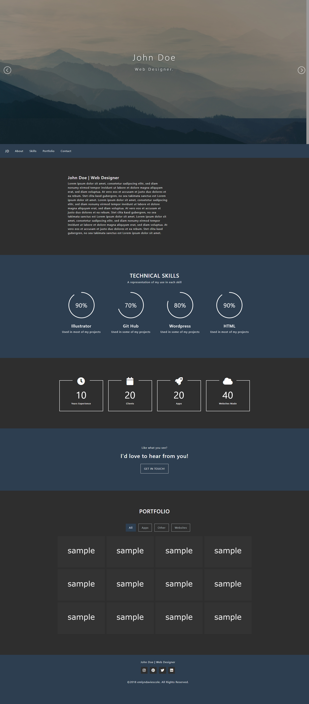

# JD Portfolio Website

A modern, responsive personal portfolio website designed to showcase professional skills, experience, and selected web projects.

🌐 **Live Demo:**  
https://edaviesc.github.io/jd_portfolio/

---

## 📸 Project Preview



> Ensure `jdportfolio.jpg` is stored in the root directory of this repository.  
> If placed inside an `/images` folder, update the path accordingly:
>
> ```markdown
> 
> ```

---

## 🚀 About The Project

JD Portfolio is a clean, single-page personal website built to highlight:

- Professional introduction
- Technical skill levels
- Experience metrics
- Portfolio work samples
- Contact call-to-action

The design emphasizes clarity, structure, and strong visual hierarchy while maintaining responsiveness across devices.

---

## ✨ Key Features

- Full-screen hero section with background imagery
- Fixed navigation bar with smooth section linking
- Professional About section
- Circular technical skill indicators
- Experience statistics counters
- Filterable portfolio grid layout
- Call-to-action contact section
- Responsive design for desktop and mobile
- Clean footer with social links

---

## 🛠️ Technologies Used

- **HTML5**
- **CSS3**
- **JavaScript**

---

## 📊 Technical Skills Displayed

The site visually represents proficiency in:

- Illustrator — 90%
- GitHub — 70%
- WordPress — 80%
- HTML — 90%

---

## 📈 Experience Highlights

- 10 Years Experience  
- 20 Clients  
- 20 Apps Developed  
- 40 Websites Created  

---

## 📁 File Structure

```plaintext
/ (root)
├─ index.html
├─ css/
│   └─ styles.css
├─ img/
│   └─ portfolio-images/
├─ js/
│   └─ scripts.js
└─ README.md
